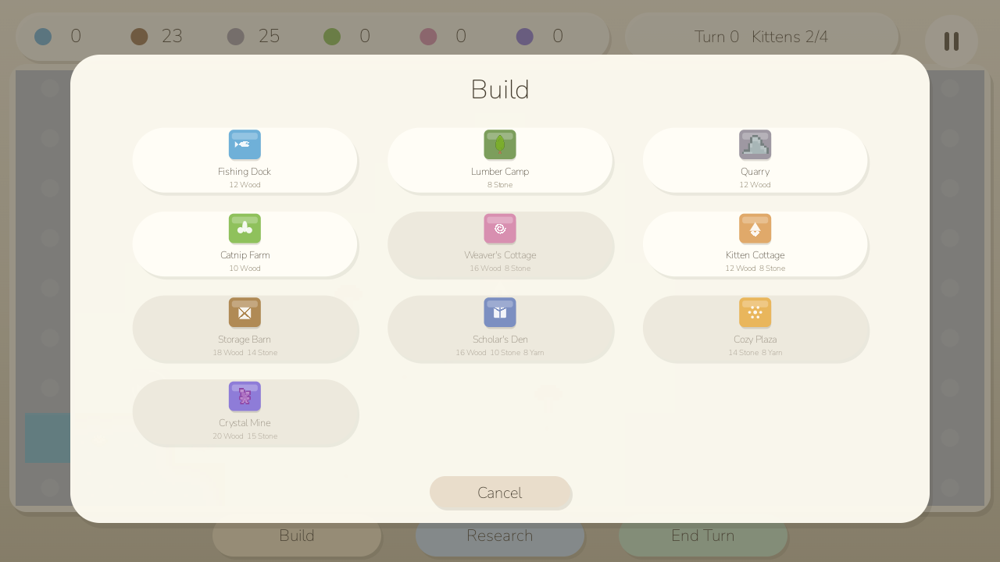
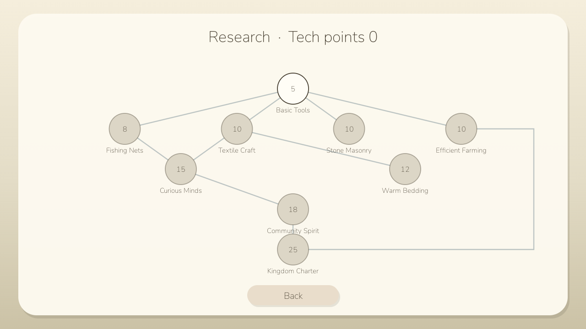

# Kitten Kingdoms


**Author:** `cocomelonc`<br>
**Copyright:** © 2026 cocomelonc (Zhassulan Zhussupov)

Kitten Kingdoms is a tiny, calm Android game about growing a kitten
settlement one gentle turn at a time. Walk a little kitten across a
continuous 96x96-tile world, uncover the land as you go, and build a small
kingdom on the ground you've discovered: gather six resources, put up eleven
kinds of buildings, research a ten-technology tree, and build peaceful
relationships with four neighbouring settlements. Visible worker kittens walk
to construction sites, collect finished goods, and carry every batch back to
the Town Hall or a Storage Barn. There are no ads,
accounts, purchases, trackers, network calls, timers, lives, or game-over
screens - a kingdom can only grow, never fail.

The game starts in English and includes an in-game `EN / RU` language switch.
Both Latin and Cyrillic use the same bundled Nunito typeface, so typography is
consistent on every Android device.

### Screenshots

The screenshots below were captured from the Android build on Android
16/API 36 after the unified terrain, animated animals, diplomacy, complete
fog-of-war surveying, and new building-icon work.

| English | Русский |
|---|---|
|  |  |

The pannable, pinch-zoomable world viewport sits below a fixed resource bar;
fog of war reveals permanently as the kitten walks, and buildings can be
placed on any discovered tile once you can afford them.


The regional World Map is a real second play layer: four settlements keep
their own relationship score, travellers take turns to arrive, and unlocked
trade routes continue exchanging resources with the home kingdom.


Build Menu is a modal card over the world; Research and How to Play are their
own full screens (real Android Activities, so the system Back gesture returns
you to the kingdom exactly as it left it):




The pause card uses the same EN/RU switch as every other screen:


### How a kingdom grows

- **Explore**: drag to pan the map, pinch to zoom, tap a tile to walk the
  kitten there. Fog of war reveals permanently in a radius around every tile
  the kitten visits - once seen, land stays known. When every reachable edge
  of a lake or stone outcrop has been surveyed, its inaccessible centre is
  revealed automatically. Exploring all walkable land is guaranteed to reveal
  every one of the world's 96x96 cells for every generated seed.
- **Build**: once a tile is discovered, open *Build* and place a construction
  site. The closest free worker walks to an adjacent tile and builds it in
  visible stages. If every kitten already has a job, the site waits instead of
  completing invisibly. Fishing Docks, Lumber Camps, and Quarries still need
  their matching water, forest, or stone terrain nearby.
- **Produce and deliver**: production buildings prepare Fish, Wood, Stone,
  Catnip, Yarn, or Crystals on *End Turn*, but the stockpile does not increase
  immediately. A resource bubble appears above the building; its assigned
  kitten collects the batch, walks to the closest completed Town Hall or
  Storage Barn, and only then deposits it. Ready queues hold up to three
  batches, and a workshop without a worker stays idle.
- **Manage workers**: tap any building for its status card. Assign or release
  a kitten at a workshop, and use the Town Hall to hire another resident for
  5 Fish and 2 Catnip. Workers keep their assignment, finish deliveries, and
  resume work automatically; coloured badges make them easy to distinguish.
- **Grow**: population grows toward each building's housing capacity as long
  as there's enough Fish; if there isn't, growth just pauses - it never
  reverses.
- **Research**: tech points accumulate every turn from the Town Hall and any
  Scholar's Dens. Opening *Research* leaves the world view for its own screen
showing the ten-node technology tree; pick a target node and once enough
  points have banked, it unlocks and any leftover points carry to the next
  choice. The system Back gesture/button returns you to the kingdom.
- **Meet neighbours**: open *World Map* to visit four distinct settlements.
  Send an envoy, dispatch a courier, or offer the resource each neighbour
  values. Strong relationships unlock permanent trade routes that exchange
  small resource bundles at the end of every turn.
- **Notice**: persistent icons identify ready goods, missing workers, and
  construction sites waiting for a builder. Small banners announce completed
  buildings, deliveries, hiring, and research.
- **End Turn**: the whole economy - production, upkeep, population, and
  research - advances when you tap *End Turn*. Walking, construction,
  collection, and delivery continue smoothly between turns.

Rabbits, hedgehogs, ducklings, and bees wander the discovered land -
purely decorative background life with no AI and no interaction with the
economy, just so the kingdom doesn't feel empty.

### Why it is deliberately small

- One focused scope: a home settlement, one continuous local map, a compact
  regional diplomacy map, six resources, eleven buildings, ten technologies,
  and four peaceful neighbours. There is deliberately no combat or army - a
  kingdom can only grow, never fail.
- No engine: a single hardware-accelerated Android `View` renders the world,
  camera, HUD, and every modal screen; only visible tiles are drawn each
  frame.
- Zero runtime dependencies, matching the rest of the series: the kingdom
  save is a small hand-written versioned binary format over plain
  `java.io` streams, not a database library. The current version 4 stores
  building queues, stable IDs, worker assignments, and carried cargo; version
  2 and 3 kingdoms migrate automatically.
- Terrain regenerates deterministically from a fixed seed and is never saved;
  only what the player has actually discovered or built is persisted.
- English and Russian resources bundled in every APK/AAB.
- Original procedural chimes and calm background music; no sampled audio
  files or codec dependency.
- The terrain uses one CC0 Kenney pixel tilesheet, including every shoreline,
  ground edge, prop, and regional marker. Buildings use an original matching
  eleven-frame sprite sheet whose silhouettes communicate their purpose at a
  glance. The animated kitten and wildlife sheets are also original
  MIT-licensed project art; Canvas is reserved for scalable interface chrome
  - see [ART.md](ART.md).

### Android configuration

| Setting | Value |
|---|---:|
| Application ID | `com.cocomelonc.kittenkingdoms` |
| Minimum SDK | 33 (Android 13) |
| Target SDK | 36 (Android 16) |
| Compile SDK | 36 |
| Java | 17 |
| Android Gradle Plugin | 8.9.1 |
| Gradle | 8.11.1 |

Because the application contains no native ELF libraries, Android's 16 KB
memory-page compatibility requirement does not apply to project code. The
verification script also checks that no `.so` file enters the APK.

`minSdk` controls the oldest Android release that can install the app, while
`targetSdk` opts the app into the behavior rules of that Android generation.
Kitten Kingdoms declares `minSdk 33` (Android 13) rather than the rest of the
series' `minSdk 26` - every code path this project needs from `Build.VERSION.
TIRAMISU` and the splash-screen API is available unconditionally, so
`MainActivity` carries no legacy branches at all. See the official Android
[`<uses-sdk>` documentation](https://developer.android.com/guide/topics/manifest/uses-sdk-element).

The verification suite builds against API 36, runs strict lint with warnings
as errors, checks APK signature/alignment and SDK declarations, and rejects
native libraries. Unit tests exercise terrain connectivity and shoreline
masks, the complete economy and technology tree, diplomacy travel and trade,
current save round-trips and legacy save migration.

### Build

Install JDK 17 and Android SDK Platform 36, then run:

```bash
export ANDROID_HOME="$HOME/Android/Sdk"
export JAVA_HOME=/path/to/jdk-17
./gradlew testDebugUnitTest lintDebug assembleDebug
```

The debug APK is written to:

```text
app/build/outputs/apk/debug/app-debug.apk
```

For a Play-ready Android App Bundle artifact:

```bash
./gradlew bundleRelease
```

The release AAB is unsigned. Configure your own upload key outside the
repository; never commit a keystore or its passwords.

### Verification

```bash
./scripts/verify_android.sh
```

It runs unit tests, strict lint, builds the APK, verifies its signature and ZIP
alignment, confirms `minSdk=33` / `targetSdk=36`, and rejects unexpected native
libraries.

The unit tests validate every content registry (terrain, resources,
buildings, technologies), prove the technology tree is acyclic and fully
reachable from its root, flood-fill the generated terrain for full
connectivity from the kitten's starting tile, validate every generated water
edge against the tilesheet's shoreline vocabulary, prove across 128 generated
seeds that exhaustive land exploration uncovers every map cell, drive the turn-based economy
through worker construction, queued production, physical delivery, hiring,
assignment, storage caps, population growth, tech-gated and terrain-gated
building placement, and upkeep shortfalls, exercise envoy,
courier, gift, and trade-route rules, and round-trip and migrate the save
format through byte streams.

### Controls

- Main menu: *Continue* (once a kingdom exists), *New Kingdom* (confirms
  before replacing a saved kingdom), and *How to Play*.
- Drag: pan the map. Pinch: zoom, from 0.6x to 1.8x.
- Tap a tile with no building selected: the kitten walks there.
- Tap *Build*, choose a building, then tap any discovered, eligible tile to
  place its construction site. A free kitten walks there and builds it.
- Tap a building to inspect its queue and worker. Production buildings let
  you assign or release a kitten; the Town Hall lets you hire residents.
- Tap *Research* to open the technology screen, then an available
  (non-greyed) node to set it as the active research target; Back returns to
  the kingdom.
- Tap *World Map* to select a neighbouring settlement, send an envoy or
  courier, offer a gift, and establish a trade route once the relationship is
  warm enough. End turns to advance travellers and route exchanges.
- Tap *End Turn* to prepare staffed production batches and resolve upkeep,
  population growth, research, diplomacy, and trade. Let workers deliver the
  batches to storage before spending them.
- Top-right pause button or Android Back: pause (or cancel a build selection
  first, if one is open). Pause also offers a *Main Menu* button.
- `EN / RU`: switch language on the title or pause screen.

### Project layout

```text
app/src/main/java/com/cocomelonc/kittenkingdoms/
  MainActivity.java       edge-to-edge Android host, lifecycle, and activity-result glue
  KittenKingdomsView.java camera, tile culling, HUD, Build and World Map overlays, input
  TechTreeActivity.java   hosts the Research screen, returns the chosen tech via Intent
  TechTreeView.java       the ten-node technology DAG, rendered full screen
  HelpActivity.java       hosts the static "How to Play" screen
  HelpView.java           four short Explore/Build/Research/Diplomacy sections
  KingdomWorld.java       turn rules, worker logistics, diplomacy, save/load glue
  WorkerKitten.java       visible worker state, cargo, assignment, and movement
  GridPathfinder.java     deterministic routes to worksites and storage depots
  WorldMap.java           96x96 deterministic terrain, fog of war, occupancy
  TerrainType.java        data-driven terrain kinds (grass, forest, water, ...)
  ResourceType.java       data-driven stockpiled resources
  BuildingType.java       data-driven building costs, output, and gates
  TechNode.java           data-driven technology tree (a DAG, not a line)
  PlacedBuilding.java     stable building ID, construction, and ready-goods queue
  WildlifeCritter.java    decorative background creature: no AI, just wanders
  Settlement.java         the four neighbouring settlement definitions
  DiplomacySystem.java    relationship, travel, gifts, and trade-route rules
  TerrainSprites.java     slices/caches the Kenney world and original building sheets
  KittenSprites.java      four-direction, four-frame kitten animation loader
  WildlifeSprites.java    two-frame wildlife animation loader
  TurnMath.java           stateless per-turn economy formulas
  KingdomSaveData.java    plain save/load transfer object
  KingdomSerializer.java  zero-dependency versioned binary save format
  AudioEngine.java        tiny procedural chime synthesizer
  MusicEngine.java        calm original procedural background music
app/src/main/res/drawable-nodpi/  Kenney terrain and original character/building sheets
app/src/test/             terrain, economy, diplomacy, and save-format tests
art/                      open-source cover, screenshots, and editable sprite sources
third_party/nunito/       exact SIL OFL license for the bundled font
third_party/kenney/       exact CC0 license for the terrain and regional markers
scripts/                  reproducible Android verification
```

### Privacy and children

The app is intentionally offline and does not collect or transmit data. See
[PRIVACY.md](PRIVACY.md). If you publish a modified build with analytics,
advertising, accounts, or network services, its privacy declarations and
Google Play Families answers must be updated.

### License

Project source and original project artwork are available under the MIT
License. The original sound effects and music are documented in
[AUDIO.md](AUDIO.md); the small set of third-party CC0 terrain tiles is
documented in [ART.md](ART.md). Nunito remains under the SIL Open Font
License 1.1; see [`third_party/nunito/OFL.txt`](third_party/nunito/OFL.txt).

Kitten Kingdoms was created by **cocomelonc**. The author and copyright notices
must remain in copies and substantial portions of the project as required by
the MIT License. See [AUTHORS.md](AUTHORS.md) and [LICENSE](LICENSE).

Contributions and translations are welcome. See [CONTRIBUTING.md](CONTRIBUTING.md).

---

### Русский

Kitten Kingdoms - маленькая спокойная Android-игра о том, как растить
кошачье поселение ход за ходом. Котёнок гуляет по цельной карте 96x96 клеток,
открывая землю по пути, а на открытых клетках можно строить: добывать шесть
видов ресурсов, возводить одиннадцать типов зданий и исследовать дерево из
десяти технологий. На отдельной карте мира живут четыре соседних поселения:
к ним можно отправлять послов и гонцов, дарить подарки и открывать постоянные
торговые пути. Здесь нет рекламы, регистрации, покупок, аналитики, сети,
таймеров, жизней и экрана проигрыша - королевство может только расти. По
открытой земле бродят кролики, ежи, утята и пчёлы - чисто декоративные, без
логики и влияния на экономику. Рабочие котята сами идут на стройплощадки,
забирают готовые партии из причала, фермы, лесопилки, каменоломни, мастерской
и шахты, а затем относят их в ратушу или ближайший амбар. Работников можно
нанимать в ратуше, назначать на здания и освобождать для новой работы.

Игра запускается на английском; язык можно в любой момент переключить на
русский кнопкой `EN / RU`. Один и тот же встроенный шрифт Nunito используется
для латиницы и кириллицы. Сборка и проверка описаны выше; основной артефакт -
обычный Android-проект с `targetSdk 36` и `minSdk 33`.
