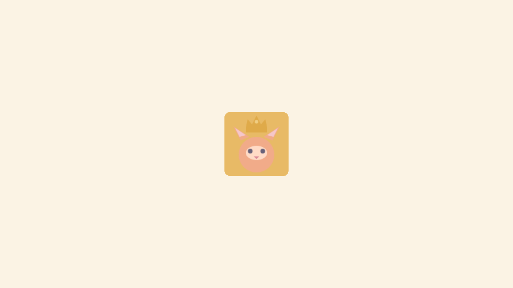
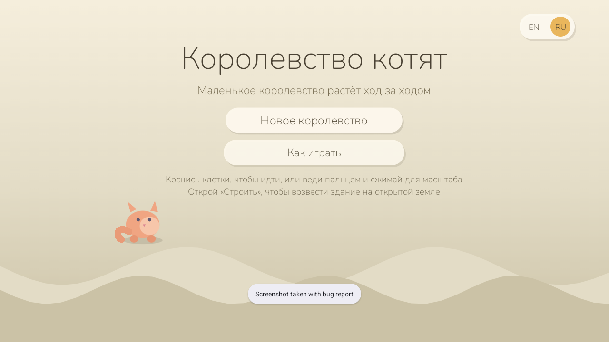
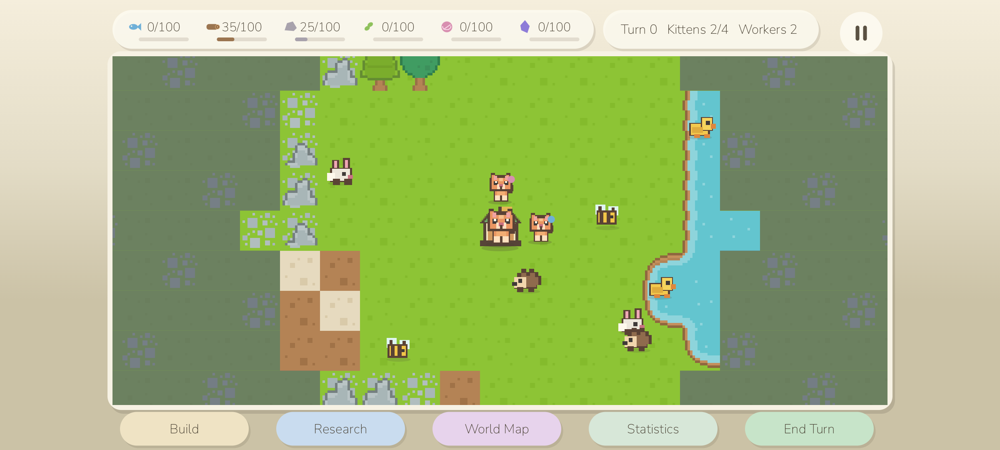
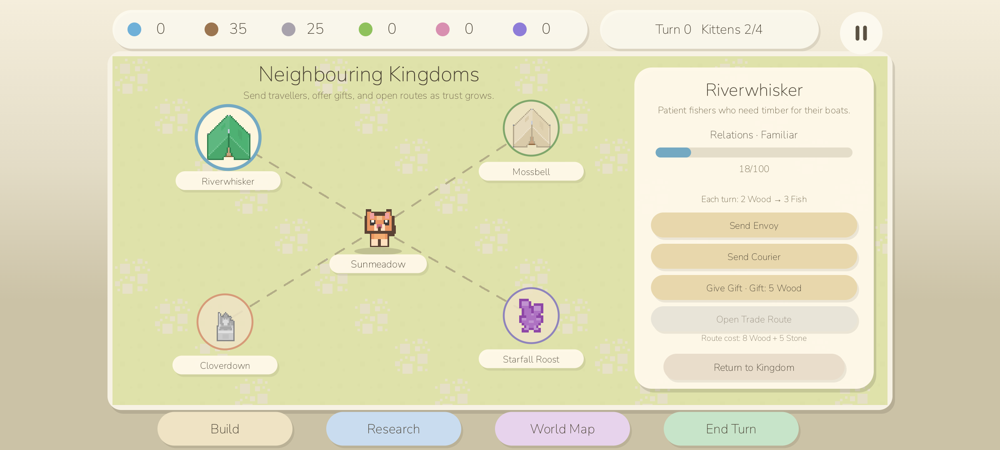
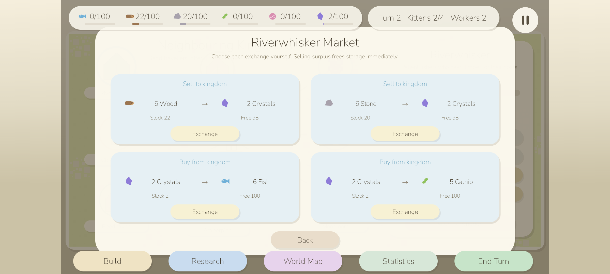
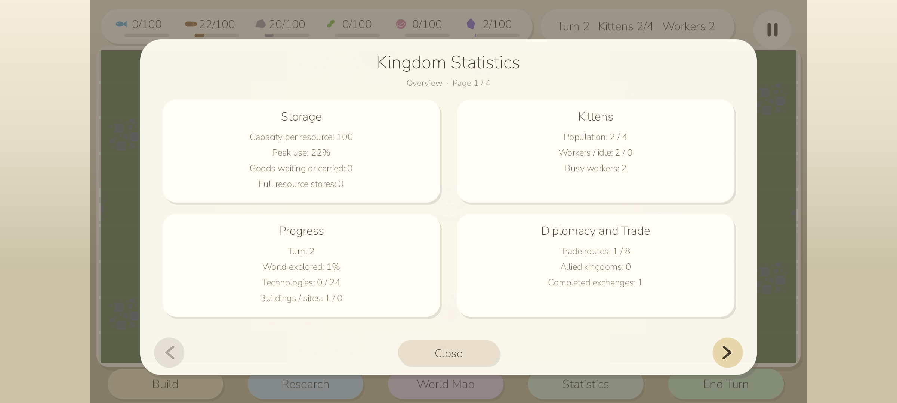
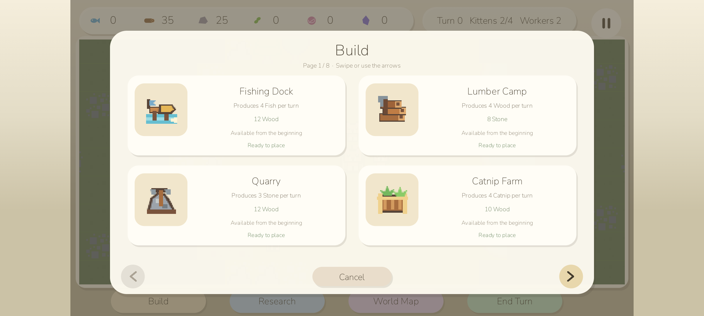
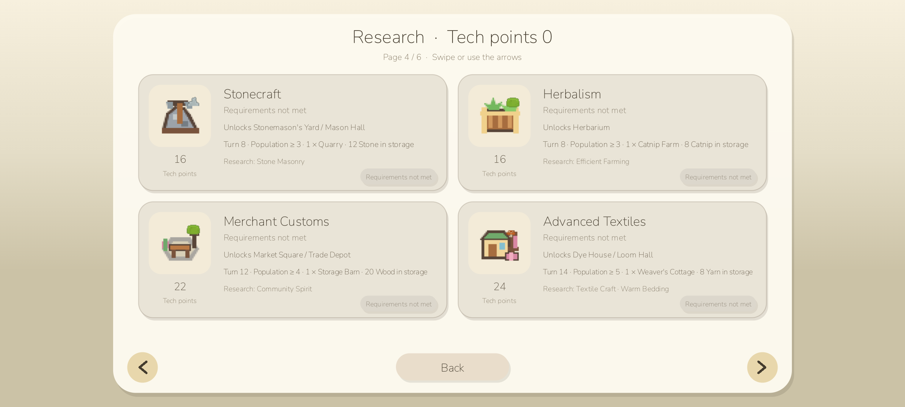
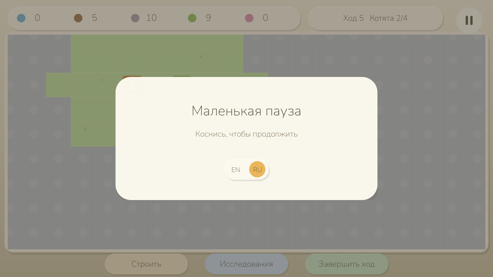

# Kitten Kingdoms



**Author:** `cocomelonc`<br>
**Copyright:** © 2026 cocomelonc (Zhassulan Zhussupov)

Kitten Kingdoms is a tiny, calm Android game about growing a kitten
settlement one gentle turn at a time. Walk a little kitten across a
continuous 96x96-tile world, uncover the land as you go, and build a small
kingdom on the ground you've discovered: gather six resources, choose among
32 kinds of buildings, research 24 technologies, and build peaceful
relationships with eight neighbouring settlements. Visible worker kittens walk
to construction sites, collect finished goods, and carry every batch back to
the Town Hall or a Storage Barn. There are no ads,
accounts, purchases, trackers, network calls, timers, lives, or game-over
screens - a kingdom can only grow, never fail.

The game starts in English and includes an in-game `EN / RU` language switch.
Both Latin and Cyrillic use the same bundled Nunito typeface, so typography is
consistent on every Android device.

### Screenshots

The screenshots below were captured from version 1.4.0 running on Android
16/API 36. They show the unified terrain, animated animals, eight-kingdom
diplomacy, manual markets, visible storage limits, and kingdom statistics.

| English | Русский |
|---|---|
|  |  |

The pannable, pinch-zoomable world viewport sits below a fixed resource bar;
fog of war reveals permanently as the kitten walks, and buildings can be
placed on any discovered tile once you can afford them.



The regional World Map is a real second play layer: eight settlements keep
their own relationship score. An envoy or courier is a real free worker who
leaves the local map, appears on the regional route as *en route*, *visiting*,
and *returning*, then rejoins the workforce at the Town Hall. Every unlocked
trade route opens a distinct four-offer market; exchanges happen only when the
player chooses them, never automatically.



Every kingdom offers its own clear two-way market after its route opens. Sell
surplus stock to free storage space, or spend Crystals on the resources that
kingdom produces. The cards always show the exact exchange, current stock, and
free destination capacity before anything is committed.



The four-page Statistics screen keeps the economy readable without crowding
the main HUD: it summarizes storage, queued deliveries, kittens, progress,
diplomatic relationships, trades, and counts for all 32 building types.



Build is an eight-page catalogue of four large illustrated cards per page:    

    

Research is a six-page catalogue using the same readable 2x2 layout:    



Both respond to a horizontal swipe or arrow buttons and play a quiet page-turn
chime. Research and How to Play are full Android Activities, so the system
Back gesture returns to the kingdom exactly as it left it. How to Play is an eight-page,
swipeable comic made with the game's real tiles, buildings, kittens, resource
icons, and EN/RU text. It explains the recommended opening, construction,
delivery, population growth, hiring, recovery when every worker is occupied,
and the later expansion path

The pause card uses the same EN/RU switch as every other screen:



### How to Play

The main-menu *How to Play* button opens the same eight chapters below as a
swipeable in-game comic. Swipe horizontally or use *Back* and *Next*; Android
Back returns to the title screen.

#### Page 1 - Meet your little kingdom

Drag to look around, pinch to zoom, and tap discovered ground to move the
royal kitten. Walking reveals fog permanently. Surveying every reachable shore
also uncovers the inaccessible middle of lakes and rocky areas. Explore first:
buildings can only be placed on discovered, reachable ground.

#### Page 2 - A balanced first pair

Build **one Fishing Dock and one Catnip Farm**. The two starting workers can
construct and operate them in parallel. Fish supports population growth; Fish
plus Catnip pays for the next worker. A second Dock can wait.

#### Page 3 - Construction needs paws

Placing a building creates a construction site rather than a completed
building. The closest free kitten walks beside it and performs each stage. An
exclamation mark means the site is safely waiting for a builder. Production
workers keep their jobs until you release them.

#### Page 4 - Goods must reach storage

*End Turn* prepares a batch at each staffed production building. A resource
icon appears above it; the assigned kitten collects the batch, carries it
across the map, and deposits it at the closest Town Hall or Storage Barn. Only
delivered goods appear in the top bar and can be spent. Every resource now
shows `stored/capacity`, a fill bar, and a clear `FULL` warning. Goods wait
safely at their workshop when that resource section is full.

#### Page 5 - Fish, Catnip, then growth

The Town Hall already houses four kittens, so an early Kitten Cottage is not
needed. Keep one Dock and one Farm staffed, wait for their deliveries, and end
turns. Fish pays the gentle food upkeep and eventually grows the population
from two residents to three.

#### Page 6 - Hire at the Town Hall

Tap the Town Hall and choose *Hire Kitten*. Hiring costs **5 Fish + 2 Catnip**
and requires the population to be larger than the current worker count. The
new worker immediately takes the oldest waiting construction job. A grey
button means resources or a free resident are still missing.

#### Page 7 - No free builder is not a dead end

If both starting kittens work at two Fishing Docks, tap either Dock and choose
*Release Kitten*. That kitten leaves the Dock and automatically builds the
oldest waiting site. Build a Catnip Farm while the other Dock keeps fishing.
Releasing a worker never removes the building or its waiting goods.

#### Page 8 - Grow one step at a time

After hiring a third worker, add a Lumber Camp. Build a Kitten Cottage only
when the Town Hall's housing limit is close: every housing place also adds five
storage spaces. Add a Storage Barn for a larger dedicated increase. Swipe
through Build and Research: later cards clearly show their turn, population,
stockpile, building-count, and prerequisite-technology conditions. The World
Map opens peaceful diplomacy and eight different markets, but every traveller
temporarily uses one free worker. The four-page Statistics screen explains
storage, queued goods, workers, exploration, technologies, every building
type, and trade relationships.

Recommended opening:

```text
Explore → Fishing Dock + Catnip Farm → Deliver goods → Grow to 3 kittens
        → Hire at Town Hall → Lumber Camp → Cottage → Storage → Research
```

### Rules reference

- **Explore**: drag to pan the map, pinch to zoom, tap a tile to walk the
  kitten there. Fog of war reveals permanently in a radius around every tile
  the kitten visits - once seen, land stays known. When every reachable edge
  of a lake or stone outcrop has been surveyed, its inaccessible centre is
  revealed automatically. Exploring all walkable land is guaranteed to reveal
  every one of the world's 96x96 cells for every generated seed. Visible trees,
  stone outcrops, and water are real obstacles: kitten routes go around them.
  The generated road network is connected and contains no one-exit dead ends.
- **Build**: once a tile is discovered, open *Build* and place a construction
  site. The closest free worker walks to an adjacent tile and builds it in
  visible stages. If every kitten already has a job, the site waits instead of
  completing invisibly. Fishing Docks, Lumber Camps, and Quarries still need
  their matching water, forest, or stone terrain nearby. Placements that would
  disconnect the road network or create a new dead end are rejected.
- **Produce and deliver**: production buildings prepare Fish, Wood, Stone,
  Catnip, Yarn, or Crystals on *End Turn*, but the stockpile does not increase
  immediately. A resource bubble appears above the building; its assigned
  kitten collects the batch, walks to the closest completed Town Hall or
  storage building, and only then deposits it. Ready queues hold up to three
  batches, and a workshop without a worker stays idle. A full resource section
  leaves its goods in the building queue; spend or sell stock, add housing, or
  build a storage building to make room.
- **Manage workers**: tap any building for its status card. Assign or release
  a kitten at a workshop, and use the Town Hall to hire another resident for
  5 Fish and 2 Catnip. Workers keep their assignment, finish deliveries, and
  resume work automatically; coloured badges make them easy to distinguish.
- **Grow**: population grows toward each building's housing capacity as long
  as there's enough Fish; if there isn't, growth just pauses - it never
  reverses.
- **Wages**: every 15 turns the workforce expects a Fish payday of 2 Fish per
  working kitten, so a larger kingdom must keep fishing to match its headcount.
  Unpaid wages become debt that quietly settles from any spare Fish; while a
  debt remains, population growth pauses. Nobody ever starves or is dismissed -
  it is a gentle pressure, not a fail state. The Statistics *Kittens* card shows
  the next payday and any outstanding wages.
- **Research**: tech points accumulate every turn from the Town Hall and
  knowledge buildings. The 24 technologies are shown as large illustrated
  cards, four per page. Earlier research is prerequisite-only; later cards can
  also require a minimum turn, population, stored resource, and number of a
  completed building. These requirements unlock the card but are not consumed.
  Pick a target and, once enough points have banked, it unlocks; leftover
  points carry to the next choice.
- **Meet neighbours**: open *World Map* to visit eight distinct settlements.
  Sending an envoy or courier requires an idle kitten. That exact numbered
  worker disappears from the home map, walks the regional route through three
  visible mission states, and returns after the round trip. Strong
  relationships unlock permanent trade routes. A route opens that kingdom's
  market with two offers to sell surplus for Crystals and two offers to buy
  useful goods with Crystals. Prices and available resources differ by
  kingdom, and no exchange happens without tapping it.
- **Read the kingdom**: open *Statistics* for four swipeable pages covering
  per-resource storage and queues, workforce, exploration, research, completed
  buildings and construction sites, counts for all 32 building types, trade
  routes, allies, and completed exchanges.
- **Notice**: persistent icons identify ready goods, missing workers, and
  construction sites waiting for a builder. Small banners announce completed
  buildings, deliveries, hiring, and research.
- **End Turn**: the whole economy - production, upkeep, population, and
  research - advances when you tap *End Turn*. Walking, construction,
  collection, and delivery continue smoothly between turns.

Rabbits, hedgehogs, ducklings, and bees wander the discovered land -
purely decorative background life with no AI and no interaction with the
economy, just so the kingdom doesn't feel empty.

### Why it is deliberately small

- One focused scope: a home settlement, one continuous local map, a compact
  regional diplomacy map, six resources, 32 buildings, 24 technologies,
  and eight peaceful neighbours. There is deliberately no combat or army - a
  kingdom can only grow, never fail.
- No engine: a single hardware-accelerated Android `View` renders the world,
  camera, HUD, and every modal screen; only visible tiles are drawn each
  frame.
- Zero runtime dependencies, matching the rest of the series: the kingdom
  save is a small hand-written versioned binary format over plain
  `java.io` streams, not a database library. The current version 7 stores
  building queues, stable IDs, worker assignments, carried cargo, and the
  exact workers reserved by diplomatic missions; kingdoms from versions 2
  through 6 migrate automatically.
- Terrain regenerates deterministically from a fixed seed and is never saved;
  only what the player has actually discovered or built is persisted.
- English and Russian resources bundled in every APK/AAB.
- Original procedural chimes and calm background music; no sampled audio
  files or codec dependency.
- The terrain uses one CC0 Kenney pixel tilesheet, including every shoreline,
  ground edge, prop, and regional marker. Buildings use an original matching
  eleven-frame base sprite sheet plus 21 in-engine variants with small Kenney
  resource emblems, keeping later tiers recognizable without mixing art
  styles. The animated kitten and wildlife sheets are also original
  MIT-licensed project art; Canvas is reserved for scalable interface chrome
  - see [ART.md](ART.md).

### Android configuration

| Setting | Value |
|---|---:|
| Application ID | `com.cocomelonc.kittenkingdoms` |
| Minimum SDK | 33 (Android 13) |
| Target SDK | 36 (Android 16) |
| Compile SDK | 36 |
| Java | 17 |
| Android Gradle Plugin | 8.9.1 |
| Gradle | 8.11.1 |

Because the application contains no native ELF libraries, Android's 16 KB
memory-page compatibility requirement does not apply to project code. The
verification script also checks that no `.so` file enters the APK.

`minSdk` controls the oldest Android release that can install the app, while
`targetSdk` opts the app into the behavior rules of that Android generation.
Kitten Kingdoms declares `minSdk 33` (Android 13) rather than the rest of the
series' `minSdk 26` - every code path this project needs from `Build.VERSION.
TIRAMISU` and the splash-screen API is available unconditionally, so
`MainActivity` carries no legacy branches at all. See the official Android
[`<uses-sdk>` documentation](https://developer.android.com/guide/topics/manifest/uses-sdk-element).

The verification suite builds against API 36, runs strict lint with warnings
as errors, checks APK signature/alignment and SDK declarations, and rejects
native libraries. Unit tests exercise terrain connectivity and shoreline
masks, the complete economy and technology tree, diplomacy travel and trade,
current save round-trips and legacy save migration.

### Build

Install JDK 17 and Android SDK Platform 36, then run:

```bash
export ANDROID_HOME="$HOME/Android/Sdk"
export JAVA_HOME=/path/to/jdk-17
./gradlew testDebugUnitTest lintDebug assembleDebug
```

The debug APK is written to:

```text
app/build/outputs/apk/debug/app-debug.apk
```

For a Play-ready Android App Bundle artifact:

```bash
./gradlew bundleRelease
```

The release AAB is unsigned. Configure your own upload key outside the
repository; never commit a keystore or its passwords.

### Verification

```bash
./scripts/verify_android.sh
```

It runs unit tests, strict lint, builds the APK, verifies its signature and ZIP
alignment, confirms `minSdk=33` / `targetSdk=36`, and rejects unexpected native
libraries.

The unit tests validate every content registry (terrain, resources,
buildings, technologies), prove the technology tree is acyclic and fully
reachable from its root, flood-fill the generated terrain for full
connectivity from the kitten's starting tile, validate every generated water
edge against the tilesheet's shoreline vocabulary, prove across 128 generated
seeds that the traversable network remains connected and dead-end-free and
that exhaustive land exploration uncovers every map cell, drive the turn-based economy
through worker construction, queued production, physical delivery, hiring,
assignment, storage caps, population growth, tech-gated and terrain-gated
building placement, and upkeep shortfalls, exercise envoy,
courier, gift, and trade-route rules, and round-trip and migrate the save
format through byte streams.

### Controls

- Main menu: *Continue* (once a kingdom exists), *New Kingdom* (confirms
  before replacing a saved kingdom), and *How to Play*. The guide can be
  browsed with horizontal swipes or its *Back* / *Next* buttons.
- Drag: pan the map. Pinch: zoom, from 0.6x to 1.8x.
- Tap a tile with no building selected: the kitten walks there.
- Tap *Build*, swipe through eight pages of four large cards, choose a
  currently unlocked building, then tap any discovered eligible tile. A free
  kitten walks there and builds it.
- Tap a building to inspect its queue and worker. Production buildings let
  you assign or release a kitten; the Town Hall lets you hire residents.
- Tap *Research*, swipe through six pages, then tap an available card to set
  it as the active target; Back returns to the kingdom.
- Tap *World Map* to select one of eight neighbouring settlements, send an
  envoy or courier, offer a gift, and establish a trade route once the
  relationship is warm enough. Open its market to choose exactly what to buy
  or sell; routes never exchange resources automatically.
- Tap *Statistics* and swipe through Overview, Storage, and two building-count
  pages.
- Tap *End Turn* to prepare staffed production batches and resolve upkeep,
  population growth, research, and diplomacy. Let workers deliver the
  batches to storage before spending them.
- Top-right pause button or Android Back: pause (or cancel a build selection
  first, if one is open). Pause also offers a *Main Menu* button.
- `EN / RU`: switch language on the title or pause screen.

### Project layout

```text
app/src/main/java/com/cocomelonc/kittenkingdoms/
  MainActivity.java       edge-to-edge Android host, lifecycle, and activity-result glue
  KittenKingdomsView.java camera, HUD, Build, World Map, Market, Statistics, input
  TechTreeActivity.java   hosts the Research screen, returns the chosen tech via Intent
  TechTreeView.java       24 illustrated research cards, four per swipeable page
  HelpActivity.java       hosts the swipeable "How to Play" comic
  HelpView.java           eight illustrated EN/RU onboarding and strategy pages
  KingdomWorld.java       turn rules, worker logistics, diplomacy, save/load glue
  WorkerKitten.java       visible worker state, cargo, assignment, and movement
  GridPathfinder.java     deterministic routes to worksites and storage depots
  WorldMap.java           96x96 deterministic terrain, fog of war, occupancy
  TerrainType.java        data-driven terrain kinds (grass, forest, water, ...)
  ResourceType.java       data-driven stockpiled resources
  BuildingType.java       data-driven building costs, output, and gates
  TechNode.java           data-driven technology tree (a DAG, not a line)
  PlacedBuilding.java     stable building ID, construction, and ready-goods queue
  WildlifeCritter.java    decorative background creature: no AI, just wanders
  Settlement.java         eight neighbouring kingdoms and their market catalogues
  MarketOffer.java        one exact buy/sell exchange without hidden randomness
  DiplomacySystem.java    relationship, travel, route, and manual-market rules
  TerrainSprites.java     slices/caches the Kenney world and original building sheets
  KittenSprites.java      four-direction, four-frame kitten animation loader
  WildlifeSprites.java    two-frame wildlife animation loader
  TurnMath.java           stateless per-turn economy formulas
  KingdomSaveData.java    plain save/load transfer object
  KingdomSerializer.java  zero-dependency versioned binary save format
  AudioEngine.java        tiny procedural chime synthesizer
  MusicEngine.java        calm original procedural background music
app/src/main/res/drawable-nodpi/  Kenney terrain and original character/building sheets
app/src/test/             terrain, economy, diplomacy, and save-format tests
art/                      open-source cover, screenshots, and editable sprite sources
third_party/nunito/       exact SIL OFL license for the bundled font
third_party/kenney/       exact CC0 license for the terrain and regional markers
scripts/                  reproducible Android verification
```

### Privacy and children

The app is intentionally offline and does not collect or transmit data. See
[PRIVACY.md](PRIVACY.md). If you publish a modified build with analytics,
advertising, accounts, or network services, its privacy declarations and
Google Play Families answers must be updated.

### License

Project source and original project artwork are available under the MIT
License. The original sound effects and music are documented in
[AUDIO.md](AUDIO.md); the small set of third-party CC0 terrain tiles is
documented in [ART.md](ART.md). Nunito remains under the SIL Open Font
License 1.1; see [`third_party/nunito/OFL.txt`](third_party/nunito/OFL.txt).

Kitten Kingdoms was created by **cocomelonc**. The author and copyright notices
must remain in copies and substantial portions of the project as required by
the MIT License. See [AUTHORS.md](AUTHORS.md) and [LICENSE](LICENSE).

Contributions and translations are welcome. See [CONTRIBUTING.md](CONTRIBUTING.md).

---

### Русский

Kitten Kingdoms - маленькая спокойная Android-игра о том, как растить
кошачье поселение ход за ходом. Котёнок гуляет по цельной карте 96x96 клеток,
открывая землю по пути, а на открытых клетках можно строить: добывать шесть
видов ресурсов, возводить 32 типа зданий и исследовать 24 технологии. На
отдельной карте мира живут восемь соседних королевств: к ним можно отправлять
послов и гонцов, дарить подарки и открывать торговые пути. Каждый путь открывает
свой рынок с двумя вариантами продажи излишков за кристаллы и двумя вариантами
покупки ресурсов. Обмен происходит только по выбору игрока. Верхняя панель
показывает запас и лимит каждого ресурса; жильё тоже увеличивает вместимость,
а четыре страницы статистики показывают очереди, работников, технологии,
здания и торговые отношения. Здесь нет рекламы, регистрации, покупок, аналитики, сети,
таймеров, жизней и экрана проигрыша - королевство может только расти. По
открытой земле бродят кролики, ежи, утята и пчёлы - чисто декоративные, без
логики и влияния на экономику. Рабочие котята сами идут на стройплощадки,
забирают готовые партии из причала, фермы, лесопилки, каменоломни, мастерской
и шахты, а затем относят их в ратушу или ближайший амбар. Работников можно
нанимать в ратуше, назначать на здания и освобождать для новой работы.

Игра запускается на английском; язык можно в любой момент переключить на
русский кнопкой `EN / RU`. Один и тот же встроенный шрифт Nunito используется
для латиницы и кириллицы. Сборка и проверка описаны выше; основной артефакт -
обычный Android-проект с `targetSdk 36` и `minSdk 33`.
